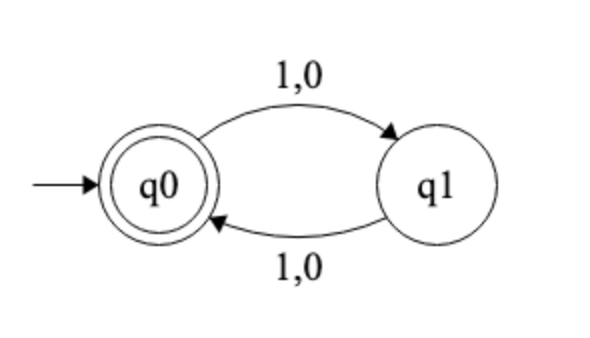
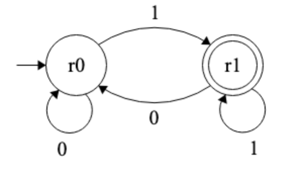
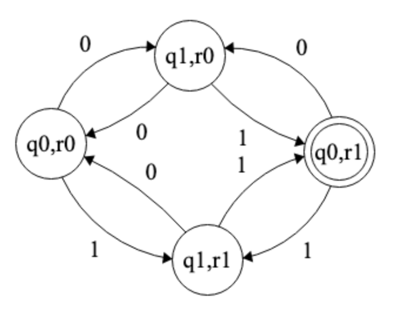

# Task 1
## Code
```python
"""
ChatGPT was used to help create this program.

Prompts used:

- I need to write python code that checks if two regular properties are consistent. How would you approach this?
- How can you represent a DFA as an input string?
- How can I implement the intersection of 2 DFAs?
- How can I implement a function to determine if the language of a DFA is empty?

"""
from collections import deque

class DFA:
    """
    A class used to represent a DFA.

    Attributes
    ----------
    states : set
        A set containing all states of the DFA.
    alphabet : set
        A set of symbols that form the alphabet of the DFA.
    start_state : str
        The initial state of the DFA.
    accept_states : set
        A set of states that are considered accepting (final) states.
    transitions : dict
        A dictionary mapping (state, symbol) pairs to the next state.

    Methods
    -------
    get_state(state, symbol)
        Returns the next state given the current state and input symbol.
    construct_dfa(dfa_string)
        Parses a formatted string to construct a DFA.
    """

    def __init__(self, states, alphabet, start_state, accept_states, transitions):
        """
        Parameters
        ----------
        states : set
            A set containing all states of the DFA.
        alphabet : set
            A set of symbols that form the alphabet of the DFA.
        start_state : str
            The initial state of the DFA.
        accept_states : set
            A set of states that are considered accepting (final) states.
        transitions : dict
            A dictionary mapping (state, symbol) pairs to the next state.
        """
        self.states = set(states)
        self.alphabet = set(alphabet)
        self.start_state = start_state
        self.accept_states = set(accept_states)
        self.transitions = transitions

    @staticmethod
    def construct_dfa(dfa_string):
        """
        Constructs a DFA object from a formatted string.

        DFA strings are formatted by their 5-tuple definition seperated by a semi-colon:

        states ; alphabet ; start_state ; accept_states ; transitions

        transitions:
            - format: current_state,input->destination
            - each transition seperated by ;
        
        Parameters
        ----------
        dfa_string : str
            A string representing some DFA.
        """
        parts = dfa_string.split(";")
        states = parts[0].split(",")
        alphabet = parts[1].split(",")
        start_state = parts[2]
        accept_states = parts[3].split(",") if parts[3] else []
        transitions = {}

        for i in range(4, len(parts)):
            if parts[i]:
                src, rest = parts[i].split(",")
                symbol, dst = rest.split("->")
                transitions[(src, symbol)] = dst
            
        return DFA(states, alphabet, start_state, accept_states, transitions)

    def get_state(self, state, symbol):
        """
        Helper function to find destination state given current state and input symbol.
        
        Parameters
        ----------
        state : str
            The current state of the DFA.
        symbol: str
            The current input symbol being read.
        """
        return self.transitions.get((state, symbol))

def combine_dfa(dfa1, dfa2):
    """
    Returns a new DFA object of the intersection of 2 DFAs.
    
    Parameters
    ----------
    dfa1 : DFA
        The first DFA object.
    dfa2: DFA
        The second DFA object.
    """
    new_states = set()
    new_transitions = {}
    new_accept_states = set()
    
    queue = deque()
    start_state = (dfa1.start_state, dfa2.start_state)
    queue.append(start_state)
    new_states.add(start_state)

    while queue:
        state1, state2 = queue.popleft()
        
        if state1 in dfa1.accept_states and state2 in dfa2.accept_states:
            new_accept_states.add((state1, state2))
        
        for symbol in dfa1.alphabet and dfa2.alphabet:
            next1 = dfa1.get_state(state1, symbol)
            next2 = dfa2.get_state(state2, symbol)

            if next1 and next2:
                new_state = (next1, next2)
                if new_state not in new_states:
                    new_states.add(new_state)
                    queue.append(new_state)
                new_transitions[((state1, state2), symbol)] = new_state
    
    return DFA(new_states, dfa1.alphabet & dfa2.alphabet, start_state, new_accept_states, new_transitions)

def is_empty(dfa):
    """
    Checks if the language of a DFA is empty using BFS.

    ie. From the starting state, if at any point an accept state can be reached,
        return False.

        Otherwise if all states of the DFA are visited and no accept state is reached,
        return True.
    
    Parameters
    ----------
    dfa : DFA
        A DFA object.
    """
    visited = set()
    queue = deque([dfa.start_state])
    
    while queue:
        state = queue.popleft()
        if state in dfa.accept_states:
            return False
        
        if state in visited:
            continue
        visited.add(state)

        for symbol in dfa.alphabet:
            next_state = dfa.get_state(state, symbol)
            if next_state and next_state not in visited:
                queue.append(next_state)

    return True

def is_consistent(dfa1_str, dfa2_str):
    """
    Main function that checks whether 2 DFA's are consistent.

        - constructs a DFA object for both string representations.
        - constructs another DFA object representing the intersection of the 2 DFAs.
        - checks whether any language is recognized by the intersection.
        - intersection is empty => DFA's not consistent.
        - intersection is non-empty => DFA's consistent.
    
    Parameters
    ----------
    dfa1_str : str
        The first string representing some DFA.
    dfa2_str : str
        The second string representing some DFA.
    """
    dfa1 = DFA.construct_dfa(dfa1_str)
    dfa2 = DFA.construct_dfa(dfa2_str)

    intersect_dfa = combine_dfa(dfa1, dfa2)
    return not is_empty(intersect_dfa)

# Example DFAs
w0 = "qstart,q0,q1;0,1;qstart;q0;qstart,0->q0;qstart,1->q1;q0,0->q0;q0,1->q0;q1,0->q1;q1,1->q1"
w1 = "rstart,r0,r1;0,1;rstart;r1;rstart,0->r0;rstart,1->r1;r0,0->r0;r0,1->r0;r1,0->r1;r1,1->r1"

x0 = "q0,q1;0,1;q0;q0;q0,1->q1;q0,0->q1;q1,1->q0;q1,0->q0"
x1 = "r0,r1;0,1;r0;r1;r0,1->r1;r0,0->r0;r1,1->r1;r1,0->r0"

print(f"Result of w0 and w1: {is_consistent(w0, w1)}")
print(f"Result of x0 and x1: {is_consistent(x0, x1)}")
```
## String Representation of DFAs
DFAs are represented by the 5-tuple definition in the program each seperated by a semi-colon and listed items seperated by commas. (This representation was created by ChatGPT)

* states ; alphabet ; starting-state ; accepting-states ; transitions

More specifically,

* "state1, ... , stateN ; char1, ... , charN ; starting-state ; accept1, ... , acceptN ; transition1 ; ... ; transitionN"

Note the transitions are formatted like this:

* "current-state, input-character->destination"

Multiple transitions are seperated by semi-colons:

* "current-state, input-character->destination;current-state, input-character->destination"

For example,

Let DFA M = {Q, Σ, δ, q0, F}.
* Q = {q0}
* Σ = {0, 1}
* δ(q0, 0) = q0, δ(q0, 1) = q0
* F = {q0}

Then the string representation for M is:

"q0;0,1;q0;q0;q0,0->q0;q0,1->q0"
## Running the Code

### w0 and w1
In the program, w0 and w1 are represented in string format by the following:
```python
w0 = "qstart,q0,q1;0,1;qstart;q0;qstart,0->q0;qstart,1->q1;q0,0->q0;q0,1->q0;q1,0->q1;q1,1->q1"
w1 = "rstart,r0,r1;0,1;rstart;r1;rstart,0->r0;rstart,1->r1;r0,0->r0;r0,1->r0;r1,0->r1;r1,1->r1"
```
Running is_consistent on w0 and w1, the program constructs 2 DFAs on the input string.

The function construct_dfa splits w0 and w1 respectively into:

```python
["qstart,q0,q1", "0,1", "qstart", "q0", "qstart,0->q0", "qstart,1->q1", "q0,0->q0", "q0,1->q0", "q1,0->q1", "q1,1->q1"]
["rstart,r0,r1", "0,1", "rstart", "r1", "rstart,0->r0", "rstart,1->r1", "r0,0->r0", "r0,1->r0", "r1,0->r1", "r1,1->r1"]
```

In each list, index 0 to index 3 are assigned to their respective attributes.

w0 for example:
* states = ("qstart", "q0", "q1") (split by commas)
* alphabet = ("1", "0") (split by commas)
* start_state = "qstart"
* accept_states = ("q0")

Since each state, alphabet character, and accept-state must be unique, ChatGPT suggested to use sets to store these respective strings. DFAs only have 1 start-state, so we can just use a normal string to store "qstart".

ChatGPT also suggested using a dictionary for storing the transitions between states where:
* **key**: (current-state, input-character)
* **value**: destination

Thus, the transitions of w0 are stored in a dictionary as the following:
```python
{('qstart', '0'): 'q0', ('qstart', '1'): 'q1', ('q0', '0'): 'q0', ('q0', '1'): 'q0', ('q1', '0'): 'q1', ('q1', '1'): 'q1'}
```

Similarly, we have the attributes for w1:
* states = ("rstart", "r0", "r1") (split by commas)
* alphabet = ("1", "0") (split by commas)
* start_state = "rstart"
* accept_states = ("r1")

and the transitions for r1:
```python
{('rstart', '0'): 'r0', ('rstart', '1'): 'r1', ('r0', '0'): 'r0', ('r0', '1'): 'r0', ('r1', '0'): 'r1', ('r1', '1'): 'r1'}
```

Following the construction of DFAs for w0 and w1, we now construct a new DFA representing their intersection.

The formal definition of DFA intersection for a DFA M is given by:

M = {Q, Σ, δ, q0, F}.
* Q = Q1 x Q2
* δ(((q, q'), x)) = (δ1((q, x)),δ2(q', x))
* F = F1 x F2

ChatGPT suggested that we can use a BFS approach to create this new DFA:

1. Initialize the intersection DFA:
    * Define the set of states, transitions, and accept states for the new DFA.
    * The start state of the intersection DFA is (start state of DFA1, start state of DFA2).
    * Add the start state to the queue and mark it as visited.
3. While the queue is not empty:
    * Dequeue a state (state1, state2).
    * For each character in the alphabet:
        * Find the next state in DFA1 using dfa1.get_state(state1, char).
        * Find the next state in DFA2 using dfa2.get_state(state2, char).
        * If both states have valid transitions, form a new state (next1, next2).
        * If this new state hasn’t been visited before, add it to the queue and mark it as visited.
        * Store the transition in the intersection DFA’s transition dictionary.
4. Mark Accepting States:
    * If both (state1) from DFA1 and (state2) from DFA2 are accepting states, then (state1, state2) is an accepting state in the intersection DFA.
5. Continue until all reachable states are visited and stored in the DFA.

Following this construction, we have:

```python
states = {('qstart', 'rstart'), ('q1', 'r1'), ('q0', 'r0')}
alphabet = {'0', '1'}
start_state = ('qstart', 'rstart')
accept_states = ()
transitions = {(('qstart', 'rstart'), '0'): ('q0', 'r0'),
               (('qstart', 'rstart'), '1'): ('q1', 'r1'),
               (('q0', 'r0'), '0'): ('q0', 'r0'),
               (('q0', 'r0'), '1'): ('q0', 'r0'),
               (('q1', 'r1'), '0'): ('q1', 'r1'),
               (('q1', 'r1'), '1'): ('q1', 'r1')}
```

Finally, we can run another BFS function, to check whether the language of the intersection of the 2 DFAs is empty:
1. Add the start state to the queue and initialize a visited set.
2. While the queue is not empty:
    * Dequeue a state
    * If at any point we reach a accepting state, return False.
    * Otherwise, explore the transitions for each character in the alphabet.
    * If the next state is unvisited, mark it as visited and add it to the queue.
3. If every state is visited and an accept state is not found, return True.

From our computed intersection of w0 and w1, we can see that there are no accept-states. So running BFS on our intersection DFA will result in no accept-states being reached. Thus, the function returns True for the DFA accepting the empty set. 

In the main function, is_consistent, the intersection recognizing the empty set means that the 2 original DFAs are inconsistent. Thus, the result of the computation on w0 and w1 is False.

### x0 and x1
Let x0 be the language over {0, 1} where L(x0) = all even length strings. 
We construct the DFA over x0, with the formal definition given by:
 
M(x0) = {{q0, q1}, {0, 1}, δ, q0, {q0}}
with transitions: 
* δ(q0, 0) = q1 
* δ(q0, 1) = q1 
* δ(q1, 0) = q0 
* δ(q1, 1) = q0 



Let x1 be the language over {0, 1} where L(x1) = all strings that end with 1. 
We construct the DFA over x0, with the formal definition given by:
 
M(x1) = {{r0, r1}, {0, 1}, δ, r0, {r1}}
with transitions: 
* δ(r0, 0) = r0 
* δ(r0, 1) = r1 
* δ(r1, 0) = r0
* δ(r1, 1) = r1





